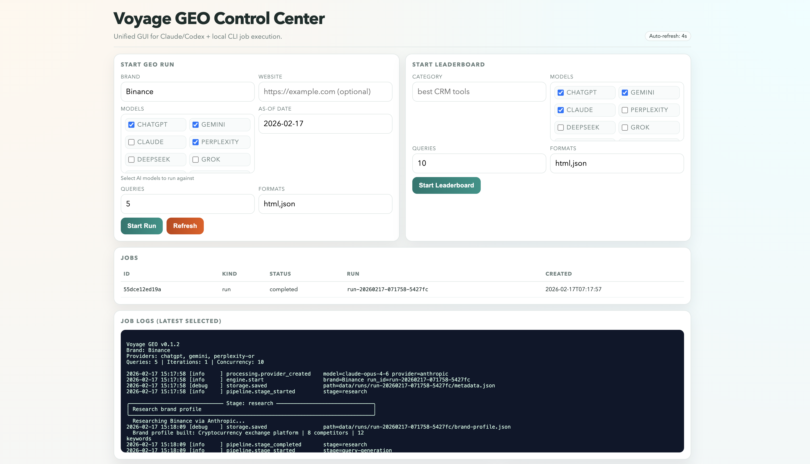

<p align="center">
  
</p>

<p align="center">
  <a href="#quick-start">Quick Start</a> ·
  <a href="#using-with-claude-code">Claude Code</a> ·
  <a href="#cli-reference">CLI Reference</a> ·
  <a href="#supported-ai-models">Models</a> ·
  <a href="./docs/">Docs</a>
</p>

<p align="center">
  <a href="https://pypi.org/project/voyage-geo/"></a>
  <a href="./LICENSE"></a>
  
  
</p>

---

Open source **Generative Engine Optimization** (GEO) CLI tool. Analyze how AI models (ChatGPT, Claude, Gemini, Perplexity, DeepSeek, Grok, Llama) reference and recommend your brand.

**SEO analytics, but for AI search engines.**

## How It Works

```
Brand Input → Research → Generate Queries → Run Against AI Models → Analyze → Report
```

1. **Research** your brand — scrapes your website, builds a brand profile with competitors, USPs, keywords
2. **Generate queries** — creates realistic search queries real people would type into ChatGPT/Perplexity (brand-blind, so queries never mention your brand)
3. **Execute** — sends queries to multiple AI models via OpenRouter (or direct API keys)
4. **Analyze** — measures mention rate, sentiment, mindshare, competitor positioning, narrative themes, USP coverage gaps
5. **Report** — generates interactive HTML reports with charts, plus JSON/CSV/Markdown exports

## Quick Start

### Prerequisites

- Python 3.11+
- An [OpenRouter API key](https://openrouter.ai/keys) (one key for all AI models), or individual provider API keys

### Install

```bash
pip install voyage-geo
```

Or install from source:

```bash
git clone https://github.com/onvoyage-ai/voyage-geo-agent.git
cd voyage-geo-agent
pip install -e .
```

### Configure API Keys

```bash
cp .env.example .env
# Edit .env — at minimum, set OPENROUTER_API_KEY
```

### Run an Analysis

```bash
# Full pipeline
python3 -m voyage_geo run -b "YourBrand" -w "https://yourbrand.com" --no-interactive

# Or with specific providers
python3 -m voyage_geo run -b "YourBrand" -w "https://yourbrand.com" \
  -p chatgpt,gemini,claude,perplexity-or -f html,json,csv,markdown --no-interactive
```

## Using with AI Agents

Voyage GEO ships 8 interactive skills that work with [Claude Code](https://docs.anthropic.com/en/docs/claude-code), [OpenClaw](https://openclaw.ai), and any agent that supports the `SKILL.md` format.

### Install Skills

Tell your agent to fetch and follow the install instructions:

```
https://raw.githubusercontent.com/onvoyage-ai/voyage-geo-agent/main/AGENTS.md
```

The agent will `pip install voyage-geo` and create the skill files automatically. Works with Claude Code, OpenClaw, and any agent that supports `SKILL.md`.

### Available Skills

| Command | Description |
|---------|-------------|
| `/geo-run` | Full GEO analysis — setup, brand research, query generation, execution, analysis, and reporting |
| `/geo-leaderboard` | Category-wide brand comparison — ranks all brands by AI visibility |

## App Mode (Optional GUI)

You can run an optional local GUI + API without changing CLI/agent workflows.

Install app extras:

```bash
pip install "voyage-geo[app]"
```

Start app mode:

```bash
python3 -m voyage_geo app --host 127.0.0.1 --port 8765
```

Then open `http://127.0.0.1:8765`.

- GUI handles run discovery, job progress, and logs.
- Backend API (`/api/*`) is the shared glue for GUI + Claude/Codex automation.
- Existing CLI and skill-based agent mode continue to work unchanged.

### Control Center Preview

The local GUI includes:
- Start GEO runs and leaderboard runs from a visual form
- Model selection with click-to-toggle checkboxes
- Live jobs table + streaming logs
- Past runs browser with one-click report opening
- Auto-generated HTML report fallback when only JSON exists



## CLI Reference

```bash
# Full analysis pipeline
python3 -m voyage_geo run -b "<brand>" -w "<url>" -p chatgpt,gemini,claude --no-interactive

# Research a brand (builds profile)
python3 -m voyage_geo research "<brand>" -w "<url>"

# List configured providers
python3 -m voyage_geo providers

# Health check providers
python3 -m voyage_geo providers --test

# Generate reports from an existing run
python3 -m voyage_geo report -r <run-id> -f html,json,csv,markdown

# Build trend index from completed snapshots
python3 -m voyage_geo trends-index -o ./data/runs --out-file ./data/trends/snapshots.json

# Query trend series for one brand (includes competitor-relative fields)
python3 -m voyage_geo trends -b "YourBrand" --metric overall_score --json

# Generate interactive HTML trends dashboard
python3 -m voyage_geo trends-dashboard -b "YourBrand"

# Start optional local GUI + API mode
python3 -m voyage_geo app --host 127.0.0.1 --port 8765

# List past runs
python3 -m voyage_geo runs

# Show version
python3 -m voyage_geo version
```

### Key Flags for `run`

| Flag | Description |
|------|-------------|
| `-b, --brand` | Brand name (required) |
| `-w, --website` | Brand website URL |
| `-p, --providers` | Comma-separated providers (default: all via OpenRouter) |
| `-q, --queries` | Number of queries to generate (default: 20) |
| `-f, --formats` | Report formats: html, json, csv, markdown (default: html,json) |
| `-r, --resume` | Resume from existing run ID |
| `--as-of-date` | Logical run date (YYYY-MM-DD) for trend tracking/backfills |
| `--stop-after` | Stop after a stage (research, query-generation) |
| `--no-interactive` | Skip interactive review prompts |

## Supported AI Models

All models are accessible through a single [OpenRouter](https://openrouter.ai) API key:

| CLI Name | Model | Provider |
|----------|-------|----------|
| `chatgpt` | GPT-5 Mini | OpenAI |
| `gemini` | Gemini 3 Flash Preview | Google |
| `claude` | Claude Sonnet 4.5 | Anthropic |
| `perplexity-or` | Sonar Pro | Perplexity |
| `deepseek` | DeepSeek V3.2 | DeepSeek |
| `grok` | Grok 3 | xAI |
| `llama` | Llama 4 Maverick | Meta |

You can also use direct API keys (OPENAI_API_KEY, ANTHROPIC_API_KEY, etc.) for individual providers.

## Environment Variables

```bash
# OpenRouter (recommended — one key for all models)
OPENROUTER_API_KEY=sk-or-v1-...

# Direct provider keys (optional)
OPENAI_API_KEY=sk-...
ANTHROPIC_API_KEY=sk-ant-...
GOOGLE_API_KEY=AI...
PERPLEXITY_API_KEY=pplx-...

# Optional
LOG_LEVEL=info
VOYAGE_GEO_OUTPUT_DIR=./data/runs
VOYAGE_GEO_CONCURRENCY=3
```

## Output Structure

Each run creates a self-contained directory:

```
data/runs/<run-id>/
├── metadata.json           # Run metadata (schema_version, status, brand/category, providers, config hash)
├── brand-profile.json      # Brand research output
├── queries.json            # Generated search queries
├── results/
│   ├── results.json        # All raw AI responses (+ schema_version)
│   └── by-provider/        # Split by provider
├── analysis/
│   ├── analysis.json       # Full analysis (+ schema_version)
│   ├── summary.json        # Executive summary (+ schema_version)
│   ├── snapshot.json       # Stable time-series KPI snapshot for trend indexing
│   └── *.csv               # CSV exports
└── reports/
    ├── report.html         # Interactive HTML report
    ├── report.json
    ├── report.md
    └── charts/             # PNG chart images
```

### Data Contract Notes

- `schema_version` is included in persisted core artifacts (`metadata.json`, `results/results.json`, `analysis/analysis.json`, `analysis/summary.json`).
- `analysis/snapshot.json` is the canonical compact record for over-time visualization and database indexing.
- `config_hash` in `metadata.json` lets you detect whether runs are directly comparable.

## Architecture

```
src/voyage_geo/
├── cli.py                # CLI entry (Typer + Rich)
├── config/               # Pydantic schemas, defaults, config loader
├── core/                 # Engine, pipeline, context, errors
├── providers/            # AI model providers (OpenRouter, OpenAI, Anthropic, Google, Perplexity)
├── stages/
│   ├── research/         # Stage 1: Brand research + web scraping
│   ├── query_generation/ # Stage 2: Generate search queries (keyword, persona, intent strategies)
│   ├── execution/        # Stage 3: Run queries against providers
│   ├── analysis/         # Stage 4: Analyze results (6 analyzers)
│   └── reporting/        # Stage 5: Generate reports (HTML/JSON/CSV/Markdown)
├── storage/              # File-based persistence
├── types/                # Shared Pydantic type definitions
└── utils/                # Text helpers, Rich progress displays
```

## Extending

| What | Interface | Location |
|------|-----------|----------|
| AI Provider | `BaseProvider` ABC | `src/voyage_geo/providers/` |
| Query Strategy | async `generate()` function | `src/voyage_geo/stages/query_generation/strategies/` |
| Analyzer | `Analyzer` Protocol | `src/voyage_geo/stages/analysis/analyzers/` |
| Report Format | Method in `ReportingStage` | `src/voyage_geo/stages/reporting/stage.py` |

See the [docs/](./docs/) directory for detailed guides on adding [providers](./docs/providers.md), [analyzers](./docs/analyzers.md), and [query strategies](./docs/query-strategies.md).

## Development

```bash
pip install -e ".[dev]"
python3 -m pytest tests/ -v
python3 -m ruff check src/ tests/
python3 -m mypy src/voyage_geo/ --ignore-missing-imports
```

## Sample report


## Contributing

See [CONTRIBUTING.md](./CONTRIBUTING.md) for guidelines.

## License

MIT — see [LICENSE](./LICENSE) for details.
